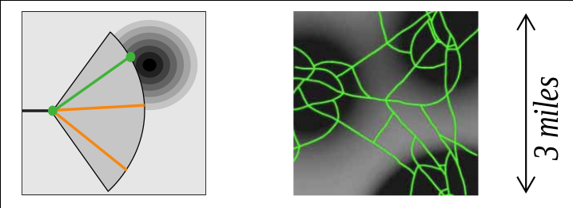

# Procedural Modeling of Cities 

# Goal and Motivation

---

**Goal**: *Automatic generation of a realistic-looking city including road structure and buildings*

. . .

### Applications

* Entertainment (Movies, Games)
* Military training
* Land use planning

## Approach

1. Choose/Process input parameters
2. Generate street network
3. Evaluate building blocks
4. Generate building structure and architecture

Optional interaction between these steps

# Modeling of the street network

## Input parameters

Need some type of contextual information

- map boundaries and obstacles
- street layouting information

. . .

**Examples**

- elevation and water map
- population density map
- vegetation map
- city type and road patterns
- city zones (residential, industrial, etc.)

## Initialization

Begin with two opposite street segments:

<iframe data-src="demo.html?
    segment_count_limit = 2;
    arrowhead_size = 80;
    draw_circle_on_segment_base = 30;
    iterations_per_frame = Infinity;
"></iframe>

## Street growth

- create new street segments greedily
- continue straight from existing end segments
- branch with some probability at ≈ 90 degrees
- label fully connected street segments as done

<iframe style="height:600px" data-src="demo.html?
    segment_count_limit = 20;
    arrowhead_size = 80;
    draw_circle_on_segment_base = 30;
    iterations_per_second = 1;
    target_zoom = 0.8;
    two_segments_initially = 0;
    only_highways = 1;
    seed = 0.03153736749663949;
    restart_after_seconds = 3;
    highway_branch_probability = 0.08;
"></iframe>

## Street hierarchy

Primary, secondary, tertiary streets are used in urban planning

→ Simplified distinction between "highways" and normal streets

. . .

- highway segments are longer and branch less
- normal streets can only branch into normal streets

<iframe style="height:400px;width:500px;" data-src="demo.html?
    segment_count_limit = 20;
    arrowhead_size = 100;
    iterations_per_second = 1;
    target_zoom = 0.8;
    highway_segment_width = 24;
    two_segments_initially = 0;
    only_highways = 1;
    smooth_zoom_start = 1;
    seed = 0.1;
    restart_after_seconds = 3;
"></iframe>
<iframe style="height:400px;width:500px;" data-src="demo.html?
    segment_count_limit = 40;
    arrowhead_size = 80;
    iterations_per_second = 2;
    target_zoom = 0.8;
    two_segments_initially = 0;
    only_highways = 0;
    smooth_zoom_start = 1;
    seed = 0.1;
    restart_after_seconds = 3;
    start_with_normal_streets = 1;
"></iframe>

## Parallel growth

New potential segments are evaluated after existing ones

<iframe style="height:500px;" data-src="demo.html?
    segment_count_limit = 40;
    //arrowhead_size = 80;
    smooth_zoom_start = 1;
    iterations_per_second = 2;
    skip_iterations = 10;
    delay_between_time_steps = 2;
    seed = 0.1;
    restart_after_seconds = 3;
    start_with_normal_streets = 1;
    priority_future_colors = 1;
"></iframe>

*red* = current step

*green* = next step

## Highway branching

Normal streets branching from highways have an additional delay (*blue*)

<iframe style="height:500px;" data-src="demo.html?
    segment_count_limit = 400;
    smooth_zoom_start = 1;
    iterations_per_second = 1.5;
    iteration_speedup = 0.2;
    two_segments_initially = 0;
    skip_iterations = 0;
    normal_branch_time_delay_from_highway = 8;
    seed = 0.018001661728973477;
    restart_after_seconds = 3;
    priority_future_colors = 1;
"></iframe>

This prevents highways being cut off by normal streets

## Conflict resolution <br> (intersections, obstacles)

> - If the new segment ends in an obstacle (e.g. water, park):  
Shorten or rotate segment to fit
> - If new segment intersects with existing street:  Shorten and create intersection
> - If existing street / intersection is near: Join road to intersection

. . .


## Global goals (1)

Population map (generated with perlin noise):

<iframe style="height:500px;" data-src="demo.html?
    segment_count_limit = 0;
    draw_heatmap = 1;
    draw_heatmap_as_threshold = 0;
    seed = 0.018001661728973477;
"></iframe>

Streets only branch if population is larger than some threshold:

<iframe style="height:500px;" data-src="demo.html?
    segment_count_limit = 0;
    draw_heatmap = 1;
    draw_heatmap_as_threshold = 1;
    seed = 0.018001661728973477;
"></iframe>

## Global goals (2)

Highways try to connect population centers

possible new directions are sampled, the one with largest population is chosen:



demo?
<iframe style="height:500px;" data-src="demo.html?
    segment_count_limit = 0;
    draw_heatmap = 1;
    draw_heatmap_as_threshold = 0;
    seed = 0.018001661728973477;
    iterations_per_second = 20;
    only_highways = 1;
"></iframe>


## Implementation as parametric L-System

Original implementation by @cities2001
```
w: R(0, initialRuleAttr) ?I(initRoadAttr, UNASSIGNED)
p1: R(del, ruleAttr) : del<0 -> e
p2: R(del, ruleAttr) > ?I(roadAttr,state) : state==SUCCEED
    { globalGoals(ruleAttr,roadAttr) creates the parameters for:
          pDel[0-2], pRuleAttr[0-2], pRoadAttr[0-2] }
    -> +(roadAttr.angle)F(roadAttr.length)
      B(pDel[1],pRuleAttr[1],pRoadAttr[1]),
      B(pDel[2],pRuleAttr[2],pRoadAttr[2]),
      R(pDel[0],pRuleAttr[0]) ?I(pRoadAttr[0],UNASSIGNED)[i]
p3: R(del, ruleAttr) > ?I(roadAttr, state) : state==FAILED -> e
p4: B(del, ruleAttr, roadAttr) : del>0 -> B(del-1, ruleAttr, roadAttr)
p5: B(del, ruleAttr, roadAttr) : del==0 -> [R(del, ruleAttr)?I(roadAttr, UNASSIGNED)]
p6: B(del, ruleAttr, roadAttr) : del<0 -> e
p7: R(del, ruleAttr) < ?I(roadAttr,state) : del<0 -> e
p8: ?I(roadAttr,state) : state==UNASSIGNED
    { localConstraints(roadAttr) adjusts the parameters for:
        state, roadAttr}
    -> ?I(roadAttr, state)
p9: ?I(roadAttr,state) : state!=UNASSIGNED -> e
```
→ unnecessarily complicated

## Implementation with priority queue

Implementation by @harmful

```javascript
function generate() {
    let Q = new PriorityQueue<Segment>();
    Q.enqueueAll(makeInitialSegments());
    let segments = [];
    while (!Q.empty() && segments.length < SEG_LIMIT) {
        let minSegment = Q.dequeue();
        // resolve conflicts
        let accepted = applyLocalConstraints(minSegment, segments);
        if (accepted) {
            segments.push(minSegment);
            // create new segments
            Q.enqueueAll(globalGoalsGenerate(minSegment));
        }
    }
}
```

## Complete demo

<iframe data-src="demo.html?"></iframe>

## Street patterns

Different patterns found in cities:

- Rectangular raster (≈ 90° angles)
- Radial
- Branching / random


---

demo walkthrough...

---

Acceleration: Quadtrees

# Modeling of buildings

## Input parameters

- Street network
- Building information (e.g. height / type / age)

## Lot subdivision

## Architektur: L-systems, split grammars, etc.


---

demo walkthrough...

---

# Alternative Methoden: Tensorfelder / Zeitsimulation

# Beispielprojekte

- CityEngine

#

## Quellen

Quellen inkl. Links sind auf der Ankündigungsseite
