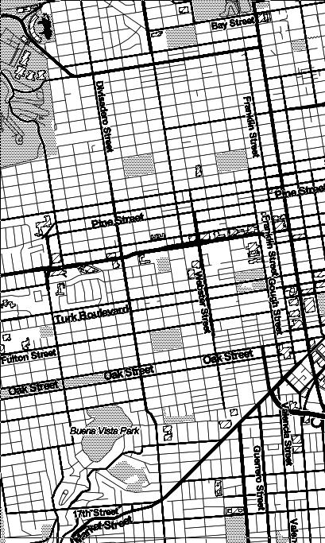
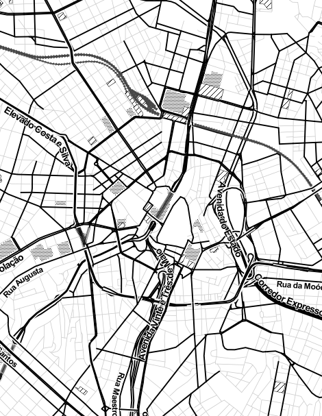
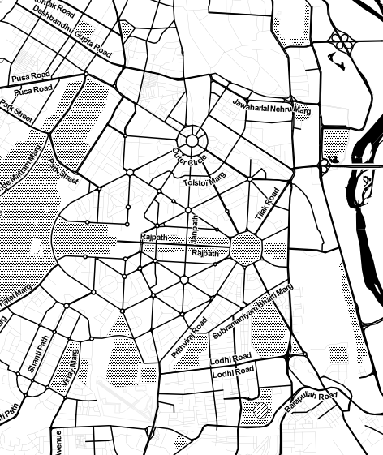
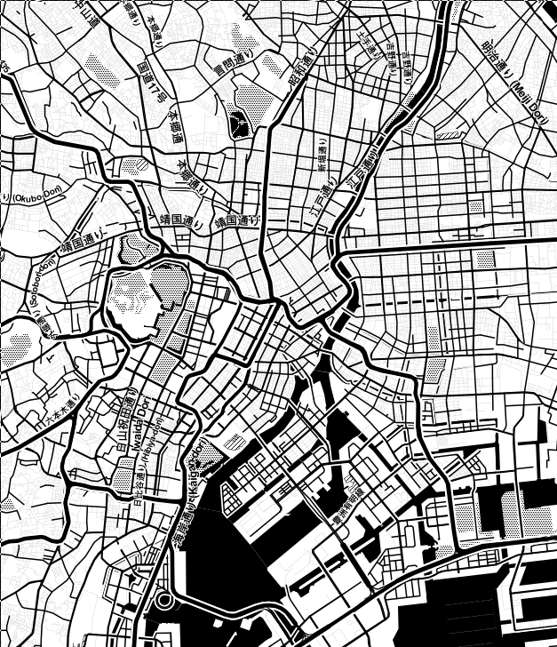
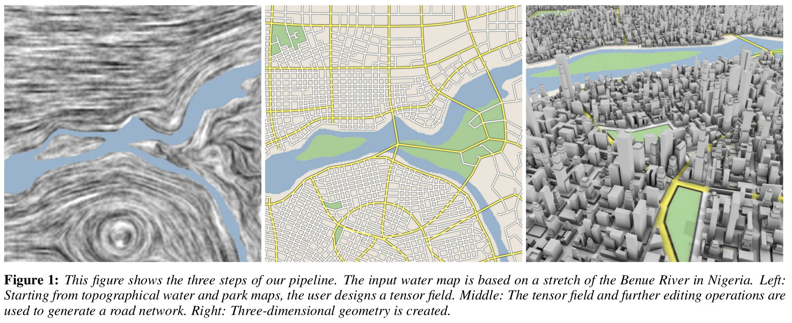

# Procedural Modeling of Cities 

# Goal and Motivation

---

**Goal**: *Automatic generation of a realistic-looking city including road structure and buildings*

. . .

### Applications

* Entertainment (Movies, Games)
* Military training
* Land use planning

## Approach

1. Choose/Process input parameters
2. Generate street network
3. Evaluate building blocks
4. Generate building structure and architecture

Optional interaction between these steps

# Modeling of the street network

## Input parameters

Need some type of contextual information

- map boundaries and obstacles
- street layouting information

. . .

**Examples**

- elevation and water map
- population density map
- vegetation map
- city type and road patterns
- city zones (residential, industrial, etc.)

## Initialization

Begin with two opposite street segments:

<iframe data-src="demo.html?
    segment_count_limit = 2;
    arrowhead_size = 80;
    draw_circle_on_segment_base = 30;
    iterations_per_second = Infinity;
"></iframe>

## Street growth

- create new street segments greedily
- continue straight from existing end segments
- branch with some probability at ≈ 90 degrees
- label fully connected street segments as done

<iframe style="height:600px" data-src="demo.html?
    segment_count_limit = 20;
    arrowhead_size = 80;
    draw_circle_on_segment_base = 30;
    iterations_per_second = 1;
    target_zoom = 0.8;
    two_segments_initially = 0;
    only_highways = 1;
    seed = 0.03153736749663949;
    restart_after_seconds = 3;
    highway_branch_probability = 0.08;
"></iframe>

## Street hierarchy

Primary, secondary, tertiary streets are used in urban planning

→ Simplified distinction between "highways" and normal streets

. . .

- highway segments are longer and branch less
- normal streets can only branch into normal streets

<iframe style="height:400px;width:500px;" data-src="demo.html?
    segment_count_limit = 20;
    arrowhead_size = 100;
    iterations_per_second = 1;
    target_zoom = 0.8;
    highway_segment_width = 24;
    two_segments_initially = 0;
    only_highways = 1;
    smooth_zoom_start = 1;
    seed = 0.1;
    restart_after_seconds = 3;
"></iframe>
<iframe style="height:400px;width:500px;" data-src="demo.html?
    segment_count_limit = 40;
    arrowhead_size = 80;
    iterations_per_second = 2;
    target_zoom = 0.8;
    two_segments_initially = 0;
    only_highways = 0;
    smooth_zoom_start = 1;
    seed = 0.1;
    restart_after_seconds = 3;
    start_with_normal_streets = 1;
"></iframe>

## Parallel growth

New potential segments are evaluated after existing ones

<iframe style="height:500px;" data-src="demo.html?
    segment_count_limit = 40;
    //arrowhead_size = 80;
    smooth_zoom_start = 1;
    iterations_per_second = 2;
    skip_iterations = 10;
    delay_between_time_steps = 2;
    seed = 0.1;
    restart_after_seconds = 3;
    start_with_normal_streets = 1;
    priority_future_colors = 1;
"></iframe>

*red* = current step

*green* = next step

## Highway branching

Normal streets branching from highways have an additional delay (*blue*)

<iframe style="height:500px;" data-src="demo.html?
    segment_count_limit = 400;
    smooth_zoom_start = 1;
    iterations_per_second = 1.5;
    iteration_speedup = 0.2;
    two_segments_initially = 0;
    skip_iterations = 0;
    normal_branch_time_delay_from_highway = 8;
    seed = 0.018001661728973477;
    restart_after_seconds = 3;
    priority_future_colors = 1;
"></iframe>

This prevents highways from being cut off by normal streets

## Conflict resolution <br> (intersections, obstacles)

> - If the new segment ends in an obstacle (e.g. water, park):  
Shorten or rotate segment to fit
> - If new segment intersects with existing street:  Shorten and create intersection
> - If existing street / intersection is near: Join road to intersection

. . .


## Global goals (1)

<div style="float:right;border:1px">
<small>Simplex noise</small><br></div>

Population map (generated with layered simplex noise):

```javascript
function populationAt(x, y) {
    const value1 = noise.simplex2(x / 10      , y / 10      ) / 2 + 0.5;
    const value2 = noise.simplex2(x / 20 + 0.5, y / 20 + 0.5) / 2 + 0.5;
    const value3 = noise.simplex2(x / 20 + 1.0, y / 20 + 1.0) / 2 + 0.5;
    return Math.pow((value1 * value2 + value3) / 2, 2);
}
```

<iframe style="height:500px" data-src="demo.html?
    segment_count_limit = 0;
    iterations_per_second = Infinity;
    draw_heatmap = 1;
    seed = 0.8174194933380932;
    smooth_zoom_start = Infinity;
    heatmap_pixel_dim = 7;
    heatmap_as_threshold = 0;
    target_zoom = 0.01;
"></iframe>


## Global goals (2)

Highways try to connect population centers

Possible new directions are sampled, the one with largest population is chosen

<iframe style="height:400px;" data-src="demo.html?
    segment_count_limit = 1000;
    draw_heatmap = 1;
    heatmap_pixel_dim = 10;
    draw_heatmap_as_threshold = 0;
    iterations_per_second = 200;
    only_highways = 1;
    restart_after_seconds = 10;
    seed = 0.8163482854142785;
"></iframe>


## Global goals (3)

Streets only branch if population is larger than some threshold:

<iframe data-src="demo.html?
    segment_count_limit = 10000;
    iteration_speedup = 1;
    draw_heatmap = 1;
    seed = 0.8174194933380932;
    heatmap_pixel_dim = 10;
    heatmap_as_threshold = 1;
    target_zoom = 1.0;
    restart_after_seconds = 7;
"></iframe>

## Global Goals (4) — Street patterns

Different patterns found in cities:

- Rectangular raster (≈ 90° angles)
- Radial
- Branching / random

![<small>[@cities2001]</small>](img/20151213214501.png)

. . .

Reality is a bit more complicated

## Street patterns — Examples


<div style="float:left">

</div>
<div style="float:left">

</div>
<div style="float:left">

</div>
<div style="float:left">

</div>

<small>http://maps.stamen.com/</small>

## Implementation as parametric L-System

Original implementation by @cities2001
```
w: R(0, initialRuleAttr) ?I(initRoadAttr, UNASSIGNED)
p1: R(del, ruleAttr) : del<0 -> e
p2: R(del, ruleAttr) > ?I(roadAttr,state) : state==SUCCEED
    { globalGoals(ruleAttr,roadAttr) creates the parameters for:
          pDel[0-2], pRuleAttr[0-2], pRoadAttr[0-2] }
    -> +(roadAttr.angle)F(roadAttr.length)
      B(pDel[1],pRuleAttr[1],pRoadAttr[1]),
      B(pDel[2],pRuleAttr[2],pRoadAttr[2]),
      R(pDel[0],pRuleAttr[0]) ?I(pRoadAttr[0],UNASSIGNED)[i]
p3: R(del, ruleAttr) > ?I(roadAttr, state) : state==FAILED -> e
p4: B(del, ruleAttr, roadAttr) : del>0 -> B(del-1, ruleAttr, roadAttr)
p5: B(del, ruleAttr, roadAttr) : del==0 -> [R(del, ruleAttr)?I(roadAttr, UNASSIGNED)]
p6: B(del, ruleAttr, roadAttr) : del<0 -> e
p7: R(del, ruleAttr) < ?I(roadAttr,state) : del<0 -> e
p8: ?I(roadAttr,state) : state==UNASSIGNED
    { localConstraints(roadAttr) adjusts the parameters for:
        state, roadAttr}
    -> ?I(roadAttr, state)
p9: ?I(roadAttr,state) : state!=UNASSIGNED -> e
```
→ unnecessarily complicated

## Implementation with priority queue

Implementation by @harmful

```javascript
function generate() {
    let Q = new PriorityQueue<Segment>();
    Q.enqueueAll(makeInitialSegments());
    let segments = [];
    while (!Q.empty() && segments.length < SEG_LIMIT) {
        let minSegment = Q.dequeue();
        // resolve conflicts
        let accepted = applyLocalConstraints(minSegment, segments);
        if (accepted) {
            segments.push(minSegment);
            // create new segments
            Q.enqueueAll(globalGoalsGenerate(minSegment));
        }
    }
}
```

<small>(+ a quadtree in *applyLocalConstraints*)</small>

# Modeling of buildings blocks and architecture

## Input parameters

- Street network
- Building information (e.g. height / type / age)

## Lot subdivision


1. Calculate areas by scaling from street crossings
2. Assume convex and mostly rectangular regions
3. Recursively divide along the longest edges that are approximately parallel
4. Discard all blocks that do not have street access

## Architecture

- L-systems, split grammars, etc.

(todo?)

# Alternative Methods

## Tensor fields



## Time simulation


# Example projects

##

- CityEngine (large commercial application originating from @cities2001)
-

#

## Quellen

Quellen inkl. Links sind auf der Ankündigungsseite
